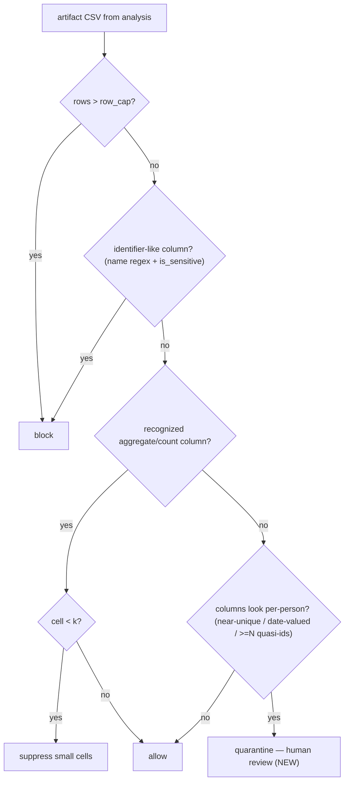

# feat: Harden the Gated Analysis Agent release gate against residual disclosure risks

## Overview

The Gated Analysis Agent's confidentiality barrier — operating-system privilege separation that denies the agent user (`cs-gated`) any read access to raw Arivale PHI — was assessed against RAND RR-A5000-1 and found sound and verified. The residual risk does not live in the barrier; it lives in the statistical disclosure-control (SDC) release policy that decides which computed outputs may cross it. This plan hardens that release policy. It closes the auto-release hole for small per-person tables, adds detective monitoring for inference-by-differencing campaigns, verifies the derived-layer dictionary path emits no per-person values, and makes the host-boundary scope explicit while guaranteeing that every hardening change actually reaches both production VMs.

The work is deliberately grounded in capability the codebase already has but does not yet apply at the release gate: the profiler's richer quasi-identifier detector (`is_sensitive`) and the real-cohort re-identification assessment (`offline_reid_assess.py`). Most units wire, verify, and extend existing mechanisms rather than inventing new ones.

## Implementation Status (2026-07-27)

All four units landed on the nightshift hardening branch:

- Unit 1 — `check_table` now quarantines count-less per-person / quasi-identifier tables (verified via `tests/gate/test_sdc.py`; the `run()` integration test is correct-by-construction but the bwrap sandbox cannot import the user-site pandas in the nightshift worktree, an environmental limitation shared by all pre-existing `run()`-based tests — it passes where pandas is in system/venv site-packages, i.e. CI and the VMs).
- Unit 2 — offline differencing monitor added (`gated_cs.gate.differencing`, `gate-monitor` console script) with `tests/gate/test_differencing.py`.
- Unit 3 — verification-first non-disclosure test added (`tests/profiler/test_add_layer_nondisclosure.py`); the derived-layer path was already safe, so `build_dictionary.py` was not changed.
- Unit 4 — host-boundary scope doc + deploy-parity script added; parity check is exercised at deploy time against the two VMs.

## Problem Frame

RAND's central finding is that safeguards depending on model cooperation cannot reliably deny a determined agent. The Gated Analysis Agent answers this structurally: the barrier is enforced by the kernel, not by the model's disposition, so jailbreaks, refusal abliteration, and safeguard-rewriting are inapplicable. The assessment confirmed this empirically (byte-identical enforcement on both VMs; `cs-gated` denied read access to data, audit, and private outputs; denied write access to the gate script).

The exposure that remains is in `gated_cs.gate.sdc.check_table`, the function that classifies every analysis artifact as allow / suppress / block. Three concrete gaps:

1. **Small per-person tables auto-release.** `check_table` blocks tables above `row_cap` (20), blocks columns whose *name* matches an identifier regex, and suppresses count cells below `k` (5) — but only when a count-like column is present. A table of twenty or fewer rows of genuine per-person quasi-identifiers with no recognized count column is returned as `allow` ("clean aggregate") and delivered without human review.
2. **Inference-by-differencing is undefended.** The barrier is deterministic, so RAND's rerun-until-success dynamic (R4) does not threaten it — but it reappears at the release decision. An agent can iterate analysis scripts to binary-search a suppression threshold and infer a suppressed value. The audit log records enough to detect this, but nothing does.
3. **The derived-layer dictionary path is unverified.** `add_layer_to_dictionary` writes a profile plus a synthesized sample of each derived layer into a dictionary the agent can read. Code review suggests it routes through per-column k-anonymity suppression and never persists raw rows, but there is no targeted test proving no per-person value from a derived matrix leaks into `dictionary.json`, `dictionary.md`, or the synthetic sample.

A fourth item is scope, not a code gap: the assessment covered the agent-versus-data boundary, not the host (hypervisor, SSH, root, who may become `cs-exec`). That boundary should be made explicit, and — because hardening is worthless if it does not deploy — every change must be verified byte-identical on both VMs.

## Requirements Trace

- R1. A table of per-person granularity (rows that are plausibly one-per-subject) with no recognized aggregate/count column must not auto-release; it must be quarantined for human review. (Residual risk 1)
- R2. `check_table` must treat near-unique and date/time-valued columns as quasi-identifiers using the profiler's existing sensitivity logic, not only name-regex matches. (Residual risk 1)
- R3. A combination of multiple quasi-identifier columns in one released table must be treated as re-identification risk even when each alone would pass. (Residual risk 1)
- R4. The audit log must be analyzable offline to flag inference-by-differencing / boundary-probing campaigns, emitting an aggregate-only report (no subject id, no raw value). (Residual risk 2)
- R5. A targeted non-disclosure test must prove the derived-layer path (`add_layer_to_dictionary`) leaks no per-person value into any dictionary artifact or synthetic sample; any leak the test surfaces is fixed. (Residual risk 3)
- R6. The host/SSH/root scope boundary must be documented as an explicit assurance gap, and a deploy-parity check must confirm the hardened `gated_cs` is byte-identical on `10.0.0.16` and `10.0.0.29` after changes land. (Residual risk 4)
- R7. No hardening may weaken an existing SDC control or break the existing `test_sdc.py` / `test_redteam.py` guarantees. All current tests continue to pass. (Regression safety)

## Scope Boundaries

- This plan does not touch the confidentiality barrier itself (user separation, sudo bridge, sandbox, file permissions). The assessment found it sound; changing it is out of scope and would add risk.
- This plan does not implement host-boundary controls (SSH hardening, root-access policy, hypervisor). It documents that boundary as an explicit gap and defers control work.
- This plan does not adopt the ACRO library. `pyproject.toml` already records ACRO as deferred; v1 remains deterministic SDC rules. Introducing ACRO is a separate, larger effort.

### Deferred to Separate Tasks

- **Inline per-session query/suppression budget** (preventive differencing defense): a stateful budget enforced in the release hot path. Deferred pending detective-monitor data (Unit 2) that shows a real probing signature and a budget that will not break legitimate iterative analysis. Future phase in this repo.
- **Host-boundary control hardening** (SSH, root access, `cs-exec` escalation policy): separate operational task; this plan only documents the gap (Unit 4).
- **ACRO integration**: separate hardening pass, per `pyproject.toml`.

## Context & Research

External research was skipped: the relevant code was read directly this session, which is stronger grounding than a summary. RAND RR-A5000-1 is the origin standard and is already synthesized in the published assessment.

### Relevant Code and Patterns

- `src/gated_cs/gate/sdc.py` — `check_table` and `Verdict`; the release gate to harden (Unit 1). Current controls: `row_cap`, `_ID` name regex, count-column k-suppression, fail-closed on non-CSV/unreadable/NaN.
- `src/gated_cs/profiler/sensitivity.py` — `is_sensitive(name, series)` already detects identifier-like names, near-unique columns (`nunique/n > 0.9`), and date-valued columns. This is the detector to wire into `check_table` (Units 1, R2).
- `src/gated_cs/gate/run_analysis.py` — `run()` iterates artifacts, calls `check_table`, routes allow/suppress → `_deliver`, block/unclassifiable → `_quarantine`, and records every verdict to the audit log. No hot-path change needed for Units 1–2; Unit 1 changes only what `check_table` returns.
- `scripts/offline_reid_assess.py` — the pattern for Unit 2 and the extension in Unit 4: an offline gate that reads real state and emits an aggregate-only JSON report with a boolean pass. Mirror its "aggregate counts / divergence metrics — never a subject id, raw timestamp, or per-subject value" discipline.
- `src/gated_cs/gate/audit.py` — `AuditLog.entries()` already reads back the append-only log; Unit 2's monitor consumes this.
- `src/gated_cs/profiler/build_dictionary.py` — `add_layer_to_dictionary` → `profile_dataframe` → `profile_column` (k-anon suppression) + `synthesize`; the path to verify in Unit 3.

### Institutional Learnings

- `tests/profiler/test_nondisclosure.py` — the OUTLIER-subject fixture pattern (`_OUTLIER_TOKEN`, unique subsecond format, lone 3am diurnal slot) that asserts a value only one subject exhibits never reaches any artifact. Unit 3 mirrors this for the derived-layer path.
- `tests/gate/test_sdc.py` and `tests/gate/test_redteam.py` — the assertion style for release-gate behavior (verdict status + `safe_df` contents; end-to-end `run()` status). Units 1 extends both.
- `pyproject.toml` comment — "ACRO deferred to a later hardening pass; v1 uses deterministic SDC rules" — confirms the deterministic-rules posture this plan stays within.

### External References

- Origin assessment (RAND mapping, verification, residual risks): the published wiki doc named in `origin`.
- RAND RR-A5000-1, *Restricting AI Agent Use of Biological Tools* — the standard; relevant findings R1–R6 are summarized in the origin doc.

## Key Technical Decisions

- **Wire the existing `is_sensitive` detector into `check_table` rather than duplicate name-regex logic.** `sdc.py` currently carries its own narrow `_ID` regex; the profiler's `is_sensitive` is strictly richer (near-uniqueness, date-valued). Reusing it keeps one source of truth for "what looks like a person" and directly closes the small-per-person-table hole. Rationale: R1, R2; avoids drift between two identifier definitions.
- **Fail closed to quarantine, never to block-only, for the new per-person heuristic.** A table that looks per-person but is not obviously an identifier goes to the human-review queue (`suppress`/quarantine semantics), not silent `allow` and not a hard `block` that loses the artifact. Rationale: preserves analyst workflow while removing auto-release; matches the existing quarantine-for-unclassifiable philosophy in `run_analysis.run`.
- **Differencing defense is detective-first (offline monitor), not preventive.** Chosen over an inline budget to avoid adding state to the deterministic release path and to avoid blocking legitimate iterative analysis. The monitor reads the audit log and emits an aggregate-only alert report; the inline budget is deferred until the monitor shows a real probing signature. Rationale: R4; user decision 2026-07-26.
- **Unit 3 is verification-first.** Treat `add_layer_to_dictionary` as correct-until-proven-leaky: write the adversarial non-disclosure test first; only change `build_dictionary.py` if the test fails. Rationale: R5; avoids speculative refactor of a path that review suggests is already safe.
- **Deploy-parity is a first-class deliverable, not a footnote.** Hardening that does not reach both VMs is not hardening. Unit 4 adds a repeatable check that the deployed `gated_cs` matches the intended version on both hosts. Rationale: R6; the assessment already relied on byte-identical parity as evidence.

## Open Questions

### Resolved During Planning

- Should the differencing defense block inline or detect offline? Detective-first offline monitor; inline budget deferred. (User, 2026-07-26)
- Does `add_layer_to_dictionary` persist raw rows? Code review says no — it stores a suppressed profile plus a synthesized sample. Converted from "fix" to "verify" (Unit 3).
- Reuse or reinvent the quasi-identifier detector? Reuse `profiler/sensitivity.is_sensitive` (Unit 1).

### Deferred to Implementation

- Exact threshold values for the per-person heuristic (near-unique ratio to adopt from `sensitivity.py`, max quasi-identifier columns before quarantine, whether `row_cap` interacts). Decide against real synthetic fixtures during implementation; expose as `Thresholds` fields so they are tunable without code change.
- The precise probing-signature definition for the monitor (window size, similarity metric for "near-identical scripts", suppress/allow oscillation pattern). Calibrate against replayed/real audit logs during implementation.
- Whether `check_table` needs the raw `DataFrame` dtype context that `is_sensitive` expects (it operates on a `pd.Series`); confirm the read-CSV frame in `run_analysis` provides adequate dtype inference or whether a light re-parse is needed.

## High-Level Technical Design

> *This illustrates the intended approach and is directional guidance for review, not implementation specification. The implementing agent should treat it as context, not code to reproduce.*

The release-gate decision after Unit 1, as a decision matrix (inputs → verdict). Only the last two rows are new; every existing row is preserved unchanged.

| Table shape | Existing verdict | Verdict after Unit 1 |
|-------------|------------------|----------------------|
| rows > `row_cap` | block | block (unchanged) |
| identifier-like column *by name* | block | block (unchanged) |
| count column present, cell < `k` | suppress | suppress (unchanged) |
| clean aggregate, count column present | allow | allow (unchanged) |
| **no aggregate column + column(s) near-unique or date-valued** | **allow** | **quarantine (human review)** |
| **≥ N quasi-identifier columns co-occurring** | **allow** | **quarantine (human review)** |

## Implementation Units

- [x] **Unit 1: Close the small-per-person-table auto-release hole in `check_table`**

**Goal:** A table with no recognized aggregate column but per-person-looking columns (near-unique, date/time-valued, or several co-occurring quasi-identifiers) is quarantined for human review instead of auto-released as a clean aggregate. Named-identifier and row-cap blocks, count-column suppression, and genuine clean aggregates are all unchanged.

**Requirements:** R1, R2, R3, R7

**Dependencies:** None

**Files:**
- Modify: `src/gated_cs/gate/sdc.py`
- Modify: `src/gated_cs/config.py` (add tunable thresholds: e.g. `near_unique_ratio`, `max_quasi_identifier_cols`, `min_aggregation_rows` — names directional)
- Modify: `tests/gate/test_sdc.py`
- Modify: `tests/gate/test_redteam.py`

**Approach:**
- Import and apply `profiler.sensitivity.is_sensitive` inside `check_table` so quasi-identifier detection uses near-uniqueness and date-valued logic, not only the local `_ID` name regex. Keep the existing `_ID` block for backward compatibility.
- Add a "no aggregate column present" branch: when no count-like column is detected and one or more columns are per-person-looking, return a quarantine verdict (reuse existing block/quarantine routing — a `Verdict` status that `run_analysis.run` already sends to `_quarantine`) with a clear reason.
- Add a quasi-identifier-combination check: when the count of quasi-identifier columns meets a configurable threshold, quarantine even if each column alone would pass.
- Thresholds live in `Thresholds` so they are tunable without code change; default values chosen against synthetic fixtures during implementation.

**Execution note:** Test-first. Add the failing "small per-person table auto-releases today" test before changing `check_table`, then make it quarantine.

**Patterns to follow:**
- `src/gated_cs/profiler/sensitivity.py::is_sensitive` — the detector to reuse.
- `src/gated_cs/gate/sdc.py::check_table` return-`Verdict` structure and existing branch ordering (block rules first, then suppression, then allow).
- `tests/gate/test_sdc.py` verdict-status + `safe_df` assertion style; `tests/gate/test_redteam.py` end-to-end `run()`-status style.

**Test scenarios:**
- Happy path: a genuine clean aggregate with a count column and cells ≥ `k` still returns `allow` (regression guard on existing `test_allows_clean_aggregate`).
- Happy path: existing count-alias suppression (`n_patients`, `sample_size`) still returns `suppress` (regression guard).
- Edge case: a table of 10 rows with a near-unique string column (e.g. one distinct value per row) and no count column → quarantine, not `allow`.
- Edge case: a table of 10 rows with a date-valued column (matches `_DATEVAL`) and no count column → quarantine.
- Edge case: a small table with two or more co-occurring quasi-identifier columns (e.g. a coarse age band plus a coarse region) each individually passable → quarantine when the combination threshold is met.
- Edge case: a 3-row genuine aggregate with a low-cardinality group column and a count column → still `allow` (must not over-quarantine legitimate small aggregates).
- Error path: an all-NaN or unreadable column does not crash `check_table`; it fails closed (quarantine/unclassifiable), consistent with existing NaN-count behavior.
- Integration: `run()` end-to-end — a script emitting a small per-person CSV yields run status `queued` (mirrors `test_redteam.test_minmax_on_identifier_queued`), and the artifact lands in the queue, not results.

**Verification:**
- A per-person table with no count column is quarantined; the audit log records the block/unclassifiable verdict with a reason naming the per-person heuristic.
- All pre-existing `test_sdc.py` and `test_redteam.py` tests still pass unchanged.

- [x] **Unit 2: Offline audit-log monitor for inference-by-differencing campaigns**

**Goal:** A standalone, offline monitor reads the append-only audit log and flags boundary-probing / differencing campaigns — repeated near-identical analysis scripts and suppress/allow oscillation that looks like a threshold binary-search — emitting an aggregate-only report with a boolean pass, mirroring the re-id assessment's non-disclosure discipline. Non-blocking; the release hot path is untouched.

**Requirements:** R4

**Dependencies:** None (consumes the audit log produced by the unchanged hot path)

**Files:**
- Create: `src/gated_cs/gate/differencing.py` (monitor logic + `main()` entry point)
- Modify: `pyproject.toml` (add a `gate-monitor` console script)
- Create: `tests/gate/test_differencing.py`

**Approach:**
- Read entries via `AuditLog.entries()`. Group by `script_hash` and by time window; compute signals: count of near-identical scripts (same or clustered `script_hash`), frequency of `suppress`/`block` verdicts on similar artifacts, and oscillation of verdicts around a boundary.
- Emit a JSON report containing only aggregate counts and signal scores — no subject id, no raw value, no script body — matching `offline_reid_assess.py`'s discipline. Include a boolean `differencing_pass` and a list of flagged windows/hashes (hashes only).
- Provide a `main()` that takes the audit path and a report path, so it runs on the box like the re-id assessment and can be scheduled.

**Execution note:** Test-first against a synthetic audit log fixture that encodes a known probing pattern.

**Patterns to follow:**
- `scripts/offline_reid_assess.py` — offline gate, real-state read, aggregate-only report, boolean pass, stdout summary line.
- `src/gated_cs/gate/audit.py::AuditLog.entries` — log read-back.

**Test scenarios:**
- Happy path: a benign log (few distinct scripts, no oscillation) yields `differencing_pass = True` and zero flags.
- Detection: a log with many near-identical `script_hash` entries in a short window and repeated `suppress` verdicts on similar artifacts is flagged (`differencing_pass = False`), with the offending window/hashes listed.
- Detection: a suppress/allow oscillation sequence indicative of threshold binary-search is flagged.
- Non-disclosure: assert the report contains no subject id, no raw value, and no script body — only counts, scores, and hashes (mirror the intent of `test_nondisclosure.py`).
- Edge case: an empty or missing audit log returns `differencing_pass = True` with an explanatory note and does not crash.

**Verification:**
- Running the monitor on a crafted probing log prints `differencing_pass=False` and writes a report naming only aggregate signals and hashes.
- Running it on a benign log passes; the release hot path and its tests are unchanged.

- [x] **Unit 3: Verify (and, if needed, fix) non-disclosure of the derived-layer dictionary path**

**Goal:** Prove that `add_layer_to_dictionary` leaks no per-person value from a derived matrix into `dictionary.json`, `dictionary.md`, or the derived layer's synthetic sample. If the test surfaces a leak, fix it in `build_dictionary.py`.

**Requirements:** R5, R7

**Dependencies:** None

**Files:**
- Create: `tests/profiler/test_add_layer_nondisclosure.py` (or extend `tests/profiler/test_add_layer.py`)
- Modify (only if the test fails): `src/gated_cs/profiler/build_dictionary.py`

**Approach:**
- Build a derived-layer `DataFrame` containing an OUTLIER subject whose value is a unique sentinel token that only one subject exhibits (mirror `_OUTLIER_TOKEN` from `test_nondisclosure.py`).
- Call `add_layer_to_dictionary` into a temp dictionary and assert the sentinel token appears in none of the written artifacts: `dictionary.json`, `dictionary.md`, and the synthetic sample CSV.
- Assert the derived layer's stored profile is a suppressed profile (per-column k-anonymity applied), and that the synthetic sample is synthesized (seeded, not copied rows).
- Only if an assertion fails, adjust `profile_dataframe`/`add_layer_to_dictionary` to suppress or omit the leaking element; re-run.

**Execution note:** Verification-first (characterization). Do not modify `build_dictionary.py` unless the test proves a leak.

**Patterns to follow:**
- `tests/profiler/test_nondisclosure.py` — OUTLIER-subject fixture and "value only one subject exhibits must never reach any artifact" assertion.
- `src/gated_cs/profiler/build_dictionary.py::add_layer_to_dictionary` / `profile_dataframe` — the path under test.

**Test scenarios:**
- Non-disclosure: a unique sentinel value present in exactly one derived-layer row appears in none of `dictionary.json`, `dictionary.md`, or the synthetic sample.
- Edge case: a near-unique derived column is stored as a suppressed profile (cardinality/sensitivity flagged), not as raw values.
- Integration: the synthetic sample for the derived layer is generated from the profile (seeded, deterministic), and its row count matches the synthesis config rather than the derived matrix's real row count.

**Verification:**
- The non-disclosure test passes (either the path was already safe, or the fix makes it safe), and no existing profiler test regresses.

- [x] **Unit 4: Document the host-boundary scope gap and add a deploy-parity check**

**Goal:** Make the host/SSH/root assurance boundary explicit in the repo, and provide a repeatable check that the deployed `gated_cs` is byte-identical to the intended version on both production VMs after hardening lands.

**Requirements:** R6

**Dependencies:** Units 1–3 (there is a hardened version worth deploying and verifying)

**Files:**
- Create: `docs/solutions/security/host-boundary-scope.md` (scope statement: what the barrier assures vs. what host compromise defeats; explicit non-goals; who may become `cs-exec`)
- Create: `scripts/verify_deploy_parity.sh` (or `.py`) — compares sha256 of the core `gated_cs` modules across `10.0.0.16` and `10.0.0.29` against the repo's intended version and prints a pass/fail
- Modify: `docs/plans/2026-07-26-001-feat-sdc-residual-risk-hardening-plan.md` (mark units complete as they land)

**Approach:**
- Write a concise scope document stating that the confidentiality barrier protects the agent-versus-data boundary and does not defend against host-root compromise, hypervisor access, or SSH/root misuse; enumerate those as explicit, separately-owned gaps.
- Provide a parity script that fetches sha256 of the core enforcement modules (`gate/run_analysis.py`, `gate/sdc.py`, and the new `gate/differencing.py`) from both VMs and compares them to each other and to the repo's built version, exiting non-zero on any mismatch. Model the comparison on the assessment's own parity evidence.

**Execution note:** Documentation and operational tooling; no behavioral code change.

**Patterns to follow:**
- `docs/solutions/` existing frontmatter/organization convention for the scope document.
- The assessment's parity method (sha256 of core modules across both hosts) for the verify script.

**Test scenarios:**
- Test expectation: none — documentation plus an operational verification script with no behavioral change. The script's own success criterion (exit non-zero on mismatch) is exercised manually against the two VMs at deploy time.

**Verification:**
- The scope document exists and is discoverable in `docs/solutions/`.
- Running the parity script after deployment reports both VMs byte-identical on the core modules (including `differencing.py`); a deliberately mismatched dry run exits non-zero.

## System-Wide Impact

- **Interaction graph:** Unit 1 changes only the verdict `check_table` returns; `run_analysis.run` already routes allow/suppress → deliver and block/unclassifiable → quarantine, so no hot-path wiring changes. Unit 2 is a separate consumer of the audit log with no write path into the gate. Unit 3 touches only the profiler dictionary path. Unit 4 is docs plus an out-of-band script.
- **Error propagation:** The new per-person heuristic must fail closed — any exception classifying a column routes the artifact to quarantine, consistent with the existing NaN-count and unreadable-artifact behavior. It must never fail open to `allow`.
- **State lifecycle risks:** None introduced in the hot path (no new persistent state; the detective monitor is stateless and read-only over the append-only log).
- **API surface parity:** `check_table` is the single release-decision surface; `run_derivation` and `run_analysis` both funnel outputs through it, so the Unit 1 change protects both paths uniformly. Confirm the derivation path's released aggregates also pass through the hardened `check_table` (it does, via `run`).
- **Integration coverage:** The end-to-end `run()` tests in `test_redteam.py` are the cross-layer proof that a per-person artifact is quarantined, not just that `check_table` returns the right verdict in isolation.
- **Unchanged invariants:** The confidentiality barrier (user separation, sudo bridge, sandbox, permissions) is untouched. All existing SDC controls (`row_cap`, name-regex block, count-column k-suppression, fail-closed on non-CSV/NaN) remain; the plan only adds quarantine paths that previously fell through to `allow`.

## Risks & Dependencies

| Risk | Mitigation |
|------|------------|
| Over-quarantining legitimate small aggregates (analyst friction) | Thresholds are tunable `Thresholds` fields; a happy-path test guards genuine small aggregates with a count column; the "no aggregate column present" branch, not row count alone, is the trigger |
| `is_sensitive` expects richer dtype context than the read-CSV frame provides, causing misclassification | Deferred-to-implementation check on dtype adequacy; light re-parse if needed; fail-closed on ambiguity |
| Detective monitor produces false positives on genuine iterative analysis | Non-blocking by design (report only); signature calibrated against real/replayed audit logs before any inline budget is considered |
| Hardening lands in the repo but not on the VMs (deployment drift; the deployed config was observed to be a subset of repo config) | Unit 4 deploy-parity check is a required post-deploy step; treat parity failure as release-blocking |
| Changing `check_table` silently weakens an existing control | R7 regression guard: full existing `test_sdc.py` / `test_redteam.py` suites must pass; new branches are additive quarantine paths only |

## Documentation / Operational Notes

- Update the published security control assessment (origin doc) with a short "Remediation" note linking this plan once units land, so the wiki record reflects that residual risks are being addressed.
- The detective monitor (Unit 2) and re-id assessment (`offline_reid_assess.py`) are both on-box, aggregate-only reporters; consider scheduling them together and routing their pass/fail to the same operator channel.
- Deploy sequence: land and test in the repo (both VMs run byte-identical code today), deploy to both VMs, then run the Unit 4 parity check before considering the work done.

## Sources & References

- **Origin document:** Security Control Assessment: the Gated Analysis Agent against RAND RRA5000-1 — https://phwiki.phenoma.ai/doc/security-control-assessment-the-gated-analysis-agent-against-rand-rra5000-1-l1rgMUg1YO
- Related code: `src/gated_cs/gate/sdc.py`, `src/gated_cs/profiler/sensitivity.py`, `scripts/offline_reid_assess.py`, `src/gated_cs/profiler/build_dictionary.py`, `src/gated_cs/gate/audit.py`
- Related tests: `tests/gate/test_sdc.py`, `tests/gate/test_redteam.py`, `tests/profiler/test_nondisclosure.py`
