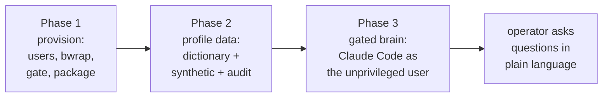

# Gated Analysis Agent: Setup Guide for a Fresh VM

This guide is written for an agent or engineer standing up the PHI-safe "code-to-data" analysis architecture on a new virtual machine. The design lets a language-model agent compute results on a sensitive tabular dataset without ever reading a raw record. It is parameterized so a different backend dataset can be substituted for the Arivale snapshot used in the reference deployment. Read the companion document, [Gated Claude Science for Arivale: A PHI-Safe Code-to-Data Analysis Agent](https://phwiki.phenoma.ai/doc/gated-claude-science-for-arivale-a-phi-safe-code-to-data-analysis-agent-iIg56VgU0i), for the rationale and validation.

## What you will build

An unprivileged operating-system user runs the analysis brain and holds no read permission on the raw data. A second user owns the data and runs a disclosure gate. The brain sees only a generated data dictionary and fabricated synthetic samples; it submits analysis scripts across a single narrow bridge; the gate runs each script sandboxed against the real data and returns only disclosure-checked aggregates, logging every submission.



## Parameters to set for a different dataset

Before starting, fix these values; the reference deployment's values are shown for orientation.

| Parameter | Reference value | What it controls |
|---|---|---|
| Data directory | `/procedure/data/local_data/ARIVALE_SNAPSHOTS_2025` | Where the raw tabular files live on the VM |
| File format | tab-delimited, 13 leading `#` metadata lines, header on line 14 | How the profiler and analysis scripts parse the tables |
| Join key column | `public_client_id` | The shared key that makes synthetic cross-table joins work |
| Gate thresholds | k = 5, row cap = 20, cardinality cap = 50 | Minimum cell size, row-dump block, categorical vocabulary cap |
| OS users | `cs-exec` (data + gate), `cs-gated` (brain) | The isolation boundary |

The profiler auto-detects the delimiter and captures `#`-prefixed metadata, so most CSV/TSV snapshots work without code changes; confirm the leading-metadata-line count and the join-key name against your data.

## Prerequisites

A fresh Linux VM with root access and outbound network. The reference VM is Ubuntu 22.04 with sixteen cores, thirty-two gigabytes of memory, and ample disk. Unprivileged user namespaces must be usable, which the provisioning script verifies. The `gated-cs` code package must be reachable from the VM; copy the repository to the box (for example under `/opt/gated-cs-src`).

## Phase 1: provision the boundary (before any data is present, non-disclosive)

Copy the repository to the VM and run the provisioning script as root. It verifies unprivileged user namespaces, installs dependencies, builds bubblewrap from source (the packaged version on Ubuntu 22.04 is 0.6.1, which is too old; the sandbox requires at least 0.8), creates the two users and a shared bridge group, locks the data directory to the data-owning user, wires the gate directories and the sudoers bridge, and installs the package into a virtual environment.

```bash
# from your workstation, copy the repo to the VM
tar czf - --exclude=.git --exclude=.venv . | ssh root@VM 'mkdir -p /opt/gated-cs-src && tar xzf - -C /opt/gated-cs-src'
# on the VM, as root
bash /opt/gated-cs-src/provision/provision.sh /opt/gated-cs-src
```

The permission model, which is the entire safety guarantee, is as follows. The raw data directory is owned by `cs-exec` with mode 700. The audit log and the quarantine queue are `cs-exec`-private. Two shared directories carry the hand-off: an `incoming` directory the brain writes and the gate reads, and a `results` directory the gate writes and the brain reads, both group-owned by the shared `csbridge` group. The gate's working root is traversable by the group but not listable. Verify, as the brain user, that reading the raw data is denied while the results directory is readable.

The sandbox that runs the untrusted analysis script must wrap only the child process, not the gate itself, so that the gate's audit and queue writes remain outside the sandbox and unreachable by the submitted code. This is enforced inside the executor. Confirm on the VM that bubblewrap functions for a non-root user and that a sandboxed process has no network.

## Phase 2: profile the data (build the dictionary and synthetic surface)

Mount or copy the raw data into the data directory. It will be owned by `cs-exec`; the brain user must not be able to read it. Then, as the data-owning user, run the profiler over the directory.

```bash
sudo -u cs-exec /opt/gated-cs/bin/build-dictionary /path/to/data --out /var/gate/dict
```

The profiler emits `dictionary.json`, `dictionary.md`, and `synthetic_samples/`. Audit the dictionary before it is delivered to the brain: confirm it contains no raw minimum or maximum keys, no known participant identifier, and no leaked dates, identifiers, or email addresses, and that identifier and date columns are flagged sensitive with their values suppressed. Real data commonly surfaces parsing edge cases; the reference deployment required handling non-finite numeric values, a header column whose name began with the comment character, and date columns that needed Safe-Harbor suppression. Treat any anomaly the audit reports as a defect to fix, not to wave through.

Generate the relational synthetic surface from the audited dictionary, which reads only the dictionary and never the raw data, and deliver both to the brain's readable location.

```bash
sudo -u cs-exec /opt/gated-cs/bin/build-synthetic --dictionary /var/gate/dict/dictionary.json --out /var/gate/dict --id-pool-size 50
```

Confirm that a cross-table join over two synthetic files on the join key returns a non-empty result, that date columns hold fabricated dates and numeric columns hold numbers, and that no real value appears in any synthetic file.

## Phase 3: stand up the gated brain (Claude Code as the unprivileged user)

Do not attempt to run the brain inside a sealed agent sandbox such as Claude Science. That path was investigated exhaustively in the reference deployment and abandoned: such sandboxes are engineered to prevent an agent from reaching a local service, and every route to the gate (privilege elevation, private-IP or non-standard-port connections, ephemeral tunnels, and single-sign-on-gated hostnames) is blocked by design. The correct runtime is an ordinary process running as the unprivileged user, where isolation is provided by the kernel and the local bridge works directly.

Install Claude Code for the brain user, create its workspace, and orient it with a `CLAUDE.md` that states it cannot read raw data and must submit scripts through `submit-analysis`. The reference workspace symlinks the dictionary, synthetic samples, and results into the brain's directory.

```bash
sudo -u cs-gated bash -lc 'curl -fsSL https://claude.ai/install.sh | bash'
# workspace /home/cs-gated/analysis with CLAUDE.md + symlinks to the dictionary and results
```

Install the operator launchers so the analyst can be started reproducibly: `claude-arivale` for an interactive session in the VM terminal, and `claude-arivale-remote` for a persistent, reattachable `tmux` session. The launchers become the brain user, enter the workspace, and start Claude Code. The operator authenticates Claude Code once, interactively, under the account that should own usage of the analyst.

## Verification checklist

- The brain user is denied read access to the raw data, and reading it returns permission-denied.
- The brain user can read the dictionary, the synthetic samples, and the results directory, but not the audit log or the quarantine queue.
- A clean aggregate submitted through the bridge is released and delivered to the results directory.
- A row-level dump is quarantined; a group with fewer than five members is suppressed; a submitted script that attempts to open the audit log or a network socket produces neither tampering nor a connection.
- Every submission appears in the append-only audit log with its script hash and verdict.

## Operating the analyst

The operator launches `claude-arivale` on the VM or `claude-arivale-remote` from anywhere, then poses analytical questions in plain language. The agent reads the dictionary, develops and tests its script against the synthetic samples, submits it to the real data through the gate, and receives a disclosure-cleared aggregate, iterating on scrubbed error messages when a script needs adjustment. Permissions are approved by the operator in-session, which keeps a human in the loop on top of the kernel and gate guarantees. The audit log is the durable record of everything the analyst has computed and should be reviewed periodically.
