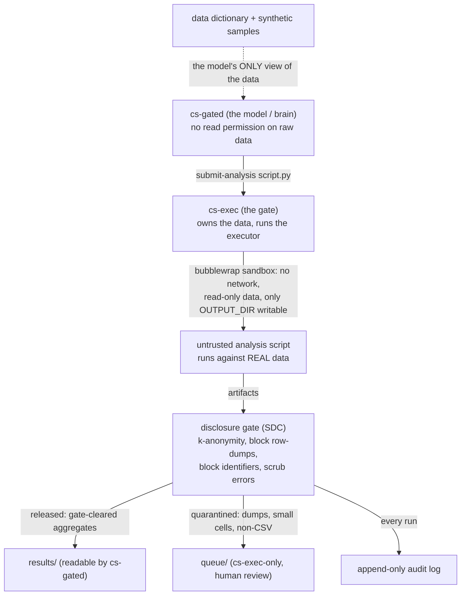

# Gated Claude Code for Arivale: A PHI-Safe Code-to-Data Analysis Agent

[https://docs.google.com/presentation/d/1vYH7puXKgkqN2xxaq2t9EiSwgWDNollpb-eGkFvrqyw/edit?usp=sharing](https://docs.google.com/presentation/d/1vYH7puXKgkqN2xxaq2t9EiSwgWDNollpb-eGkFvrqyw/edit?usp=sharing)

## Key takeaways

* An LLM agent computes results on the real Arivale cohort **without ever reading a raw record**: it sees only a disclosure-safe data dictionary and fabricated synthetic samples, while a separate privileged executor runs its scripts against the real data and returns only disclosure-checked aggregates.
* **The boundary is enforced by the operating system, not the model.** The agent runs as an unprivileged user with no read permission on the data, and every path back from the data passes through a disclosure gate that suppresses small cells, blocks row-level output and identifier columns, and audits every submission.
* **The guarantee holds at every stage, the dictionary's own construction included:** the deterministic profiler was developed against synthetic fixtures and run on the real data by a human operator who relayed back only non-disclosive outputs, so no model ever saw the rows it describes.
* **The system is live and reproduced identically across three virtual machines.** The first cross-table result, mean fasting glucose by sex, was physiologically plausible and identical on all three (see Validation).
* **It is a reusable template, not a one-off.** The profiler, gate, and bridge are dataset-agnostic; a different backend needs only a re-pointed executor and a regenerated dictionary, and an identical-dataset instance needs only the scripts plus a copy of the audited dictionary.
* **The boundary is extensible, not just queryable.** A `submit-derivation` verb lets the agent compute per-person derived features (imputation, biological-age or uniqueness scores, metabolite ratios) and persist them inside the boundary for reuse, while only fit-quality aggregates are released. It was proven live with a metabolite-imputation layer that a later analysis reused, the model never touching a derived row.
* **The sharpest lesson concerns runtime.** Claude Science, our first choice, is sandboxed to prevent an agent from reaching any local service, which is precisely the capability a gated agent requires, so we pivoted to Claude Code running as the unprivileged user, where the kernel provides isolation and the local bridge works directly.

## The problem

Granting an LLM agent direct access to protected health information is unacceptable, and a prompt-level instruction not to read raw rows is not a control. The goal was to keep the agentic, code-writing benefit while making it structurally impossible for the model to touch a raw record, the clean inverse of an auto-executing agent that runs with full data access. This is the trusted-research-environment "code-to-data" model, exemplified by [OpenSAFELY](https://en.wikipedia.org/wiki/OpenSAFELY) and governed by the Five Safes framework with its Safe Outputs layer: analysts develop against dummy data, submit code for remote execution against records they never see, and outputs are disclosure-checked before release. We reduced that model to an OS-enforced boundary.

## Architecture

Three trust zones separate the model from the data, bound by two operating-system users. Raw records are readable by exactly one identity, and every path a value can take out of that identity passes through the gate.

**The dictionary is the model's only description of the data.** A deterministic profiler reads the raw tables once, as the data-owning user, and emits human- and machine-readable dictionaries plus synthetic samples. Per column it records structure, missingness, cardinality, suppressed-small-bin histograms for numerics, and capped categorical vocabularies, and it flags identifier and date columns as sensitive with their values withheld; it never records a raw minimum, maximum, identifier, or date.

**The synthetic samples are the development surface.** Fabricated from the dictionary alone (detailed below), they are type-faithful and share fabricated join keys, so the model can develop and test scripts, including cross-table joins, before any real-data run.

**The gate is the Safe Outputs layer.** A privileged executor runs each submitted script in a bubblewrap sandbox with no network, the data bound read-only, and one writable output directory, then applies statistical disclosure control to every artifact: a minimum cell size of five with secondary suppression, a block on any table exceeding a row cap or bearing an identifier-like column, and scrubbing of values embedded in error text. Clean aggregates are released to a directory the model can read; anything disclosive is quarantined for human review; every submission is recorded.

## What we built

The implementation is a lean Python package developed test-first across 45 commits and 92 passing tests.

The **profiler** turns a directory of tabular files into the disclosure-safe dictionary and synthetic surface. Its disclosure model was hardened repeatedly: grid-aligned histogram edges so no raw extreme appears as a bin boundary, a constant-column guard, k-anonymity suppression of rare categories, HIPAA Safe-Harbor identifier and date detection, and type-appropriate synthetic fabrication with shared join keys.

The **gate** comprises the disclosure checks, error scrubbing, the append-only audit log, the sandboxed executor, a human review queue, and an adversarial test suite. Review hardened the executor to quarantine every non-CSV artifact, to write an audit entry for every run including those that produce nothing, and to give each quarantined artifact a unique name so evidence is never overwritten.

The **bridge** is a narrow, single-command privilege boundary: the model's user may invoke exactly one command as the data-owning user, and that command sandboxes only the untrusted script, keeping the gate's own audit and queue writes outside the sandbox. This was verified live: a script that tried to open the audit log and a network socket produced no tampering and no connection.

## How the synthetic surface is generated

The synthetic samples are fabricated entirely from the dictionary, never from a real row, a property made explicit by two entry points: the profiler emits them as it writes the dictionary, and a standalone command regenerates the identical surface from the dictionary JSON alone, with no data access.

Generation is per-column, by the rule the dictionary recorded. A join-key column is drawn from a single pool of fabricated keys shared across every file (`SYNTH_0000` through `SYNTH_0049` by default), so a cross-table join returns overlapping rows on the synthetic data exactly as on the real data. A numeric column carrying a histogram is sampled marginal-faithfully: a bin is chosen with probability proportional to its count, a value is drawn uniformly within it, and the result is cast to the column's type. A categorical column is drawn uniformly from its recorded vocabulary; a histogram-less numeric from its declared type over a generic range; a date-named column receives a fabricated date; any remaining column receives an opaque, type-shaped token. No column is a suppression placeholder; every one is a concrete, type-appropriate value, so a script exercises the same code path it would on the real data.

The values are safe because their only source, the dictionary, was stripped of disclosive content first. Numeric histograms sit on a data-independent grid: round nice-step edges, the upper edge placed strictly beyond the maximum so no real extreme becomes a boundary, no histogram for constant columns, non-finite values removed, and sub-threshold bins dropped. Categorical vocabularies are k-anonymized to values occurring at least five times. Identifiers and dates are withheld. The synthesizer thus samples only from marginals and vocabularies already free of small cells, raw extremes, and identifiers, inheriting their non-disclosiveness.

The intent is fidelity of code paths, not of values: sharing the real schema, types, and join keys, a script that runs on the synthetic data almost always runs unchanged on the real data, and the residual gap of genuinely data-specific edge cases is closed by the gate's scrubbed error messages on the first real run. Generation is seeded, so the surface is reproducible across regenerations and machines.

## Validation on real data

The reference instance runs on a virtual machine (Ubuntu 22.04.5, Python 3.10.12, bubblewrap 0.11.0 built from source). The Arivale snapshot arrived world-readable and was locked to the data-owning user before any profiling. The profiler produced a dictionary over all 76 tables and 36 005 columns; the audit confirmed zero raw minimum or maximum values, no known participant identifier, and no leaked dates, identifiers, or emails, with 487 columns suppressed.

Real data surfaced defects no fixture would have, each caught and corrected: a numeric column with non-finite values, a microbiome header column literally named `#OTUs` that a naive comment-stripping reader dropped, and date columns listed as categories until the sensitivity heuristic was tightened to Safe-Harbor. Critically, these were diagnosed without any model seeing raw data: the profiler was tested against synthetic fixtures, and its real-data runs were executed by a human operator who relayed back only non-disclosive outputs (the dictionary, the row and column counts, the leak audit), so the model refined it from column names, error types, and audit findings alone. The guarantee that the model never reads a raw record therefore holds not only at runtime but back through the dictionary's construction.

The first end-to-end scientific result joined the chemistries and demographics tables on the participant key and computed per-client mean fasting glucose by biological sex.

| sex | clients | mean glucose (mg/dL) | SD  |
|-----|---------|----------------------|-----|
| Female | 2 883   | 92.1                 | 17.4 |
| Male | 1 996   | 96.2                 | 17.2 |

The male excess of approximately four mg/dL matches the direction and magnitude reported in the literature, and it is robust to longitudinal weighting: averaging by draw rather than by client shifted each mean by no more than 0.2 mg/dL, near-identically across sexes. Every validation run released a result and logged an append-only audit entry attributable to its submitted script by content hash.

## Reproducibility across a fleet

The architecture was reproduced on two further virtual machines, each serving the identical Arivale snapshot and each verified end-to-end to the same released result. Because the dictionary and synthetic samples derive from the data rather than the machine, they were copied to each new instance rather than regenerated; provisioning is otherwise scripted, so an additional box reaches a verified state in minutes. One hazard recurred on every machine: the snapshot mounts world-readable, exposing raw records to the model's user until locked. A single command run immediately after each mount restores the data-owning user's exclusive access and confirms the model's user is denied; no agent was authenticated during any exposure interval, so no raw record was read, but the lock is now a standard post-mount step.

## Working alongside JupyterLab

Each machine also runs a managed JupyterLab as root over the shared `/procedure` tree, and the analyst's workspace is surfaced there through a strictly one-way live mirror, so an operator can open and run the agent's scripts against the real data in a familiar environment. The direction is load-bearing: the workspace holds only non-disclosive artifacts and is mirrored outward, while nothing written on the JupyterLab side flows back into the agent's readable space. A two-way share would let the model read whatever a privileged process placed in the folder, which on a root-run, multi-user notebook server is a route by which a raw extract could reach the model; the mirror is therefore one-way and read-only. The model's output becomes visible to its human supervisors without weakening the boundary.

## A derived-data layer

The same boundary that runs one-off analyses also supports building on them. A second verb,
`submit-derivation`, lets the agent compute per-person derived features — imputed metabolite values,
biological-age or uniqueness scores, metabolite ratios — and persist them inside the boundary for reuse,
while only fit-quality aggregates are released. The derived matrix is written to a store owned solely by
the data-owning user and unreadable by the model (mode 0700), so a per-person derived value, which is
itself protected health information, never leaves as a row. Each layer is auto-profiled into the
dictionary and synthetic surface, so the model develops against it exactly as it does a raw table, and a
later analysis reads the layer and joins it to raw tables on the participant key.

Three properties keep the extension safe. The writable path a derivation uses is separate from the
release path: the derived matrix goes to the store and is never gate-checked or delivered, while the
fit-quality outputs pass through the unchanged disclosure gate. Provenance for each layer is written by
the executor, not the model's code, so it cannot be forged. And derived columns inherit the profiler's
sensitivity screening, so a feature that re-encodes an identifier or a date is suppressed like a raw one.
The design was proven live: an imputation derivation persisted a forty-metabolite per-person layer
(cross-validated R-squared of approximately 0.22), the layer appeared in the dictionary tagged as
derived, and a separate analysis then read it and released mean imputed-metabolite levels rising
monotonically across fasting-glucose tertiles, with the model never exposed to a raw or a derived row.

## The runtime lesson

Our original design placed the brain inside Claude Science, whose OS-user isolation held perfectly; the obstacle was that Claude Science sandboxes the agent to prevent it from reaching any local service. We confirmed, in sequence, that the sandbox blocks privilege elevation through a no-new-privileges flag, refuses connections to private or reserved IP addresses and non-standard ports, denylists ephemeral tunnel hostnames, and routes every organizational hostname through single-sign-on a programmatic agent cannot complete. Each barrier is correct on its own terms; together they make Claude Science structurally incompatible with a gated agent that must reach a co-located gate.

We therefore pivoted to Claude Code running as the unprivileged user. Because it is an ordinary process, the single-command bridge we had already built worked directly, with no network dependency. The isolation did not move: the unprivileged user still cannot read a raw record, and every analysis still passes through the gate. The lesson is that security must live in the kernel, not in the model or its runtime, so the brain can be swapped without weakening the boundary.

## Governance and limitations

Every analysis is recorded in an append-only audit log naming the submitting script by content hash, the disclosure verdict, and the delivered or quarantined artifact. That log is the governance ground truth for everything computed against the data, independent of which account or model drives the agent, and it should be reviewed periodically.

Two honest limitations remain on the record. First, automated statistical disclosure control cannot fully defeat differencing attacks across multiple queries; the human review queue and the audit log are the backstop, and any release of real protected health information still warrants data-use-agreement-level sign-off. Second, the boundary isolates the model, not a privileged attacker: a compromise of the data-owning user or of root would expose the data, so host security remains a prerequisite rather than a solved problem.

## Status

The system is operational across the fleet. The gated analyst is launched with `claude-arivale` for an interactive session or `claude-arivale-remote` for a persistent, reattachable one, and an operator poses questions in plain language while the agent handles schema discovery, synthetic development, and disclosure-safe aggregation. A companion document, [Gated Analysis Agent: Setup Guide for a Fresh VM](https://phwiki.phenoma.ai/doc/gated-analysis-agent-setup-guide-for-a-fresh-vm-P1i6bjQ9MT), documents how to reproduce the architecture on a fresh virtual machine, whether for the same dataset or a different tabular backend.