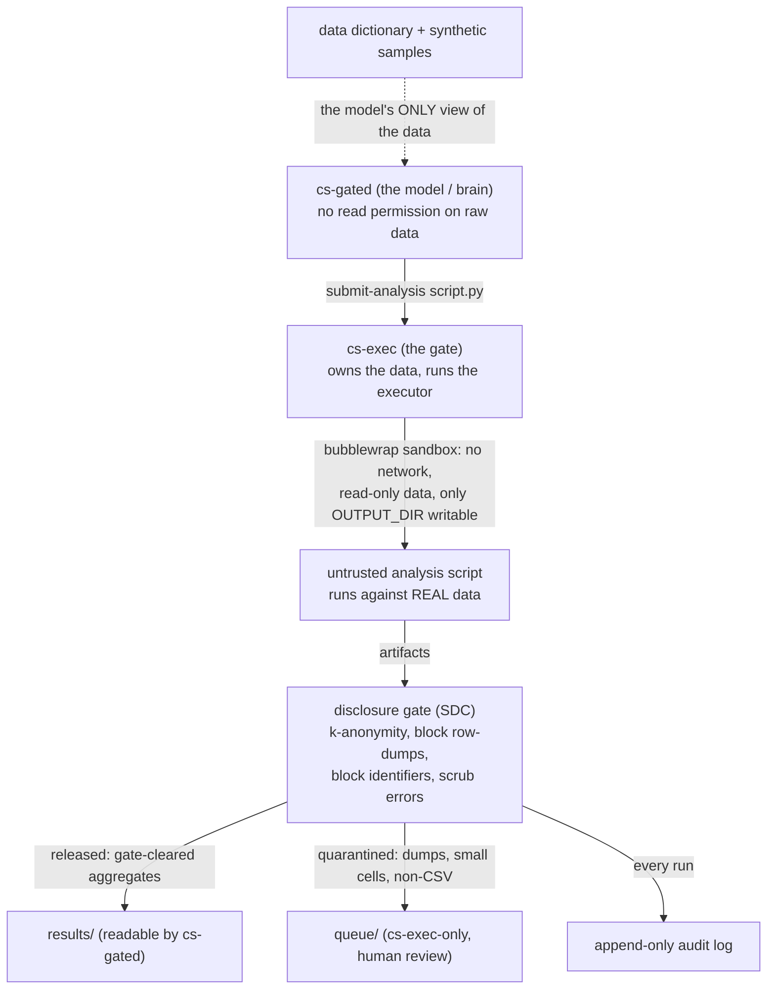

# Gated Claude Science for Arivale: A PHI-Safe Code-to-Data Analysis Agent

## Key takeaways

- We built and validated an analysis agent that computes results on the real Arivale cohort without ever reading a raw record. The agent sees only a disclosure-safe data dictionary and fabricated synthetic samples; it writes analysis scripts that a separate, privileged executor runs against the real data, returning only disclosure-checked aggregates.
- The safety boundary is enforced by the operating system, not by the language model. The agent runs as an unprivileged user that holds no read permission on the raw data, and every path from the data back to the agent passes through a disclosure gate that suppresses small cells, blocks row-level output and identifier columns, and records every submission in an append-only audit log.
- The system is live on VM 10.0.0.50. A first real cross-table analysis, mean fasting glucose by biological sex joining the chemistries and demographics tables, returned 92.1 mg/dL for female clients (n = 2 883) against 96.2 mg/dL for male clients (n = 1 996), a physiologically plausible difference, computed and released through the gate with the model never exposed to a single row.
- The PHI-safe dictionary covers all 76 Arivale tables (36 005 columns), audited to contain no raw minimum or maximum values, no participant identifiers, and no dates; 487 identifier- and date-bearing columns were suppressed.
- The most instructive lesson concerns the runtime. Anthropic's Claude Science, our first choice for the agent, proved to be the wrong tool: its sandbox is deliberately engineered to prevent an agent from reaching any local service, which is precisely the capability a gated analysis agent requires. We pivoted the agent to Claude Code running as the unprivileged user, where isolation is provided by the kernel and the submission bridge we had already built works directly.

## The problem

Large-language-model agents are powerful analysts, but granting one direct access to protected health information is unacceptable, and a prompt-level instruction not to read raw rows is not a control. The task was to retain the agentic, code-writing benefit while making it structurally impossible for the model to touch a raw record. This is the clean inverse of an auto-executing analysis agent that runs with full data access; here the data never enters the model's context, and the model's code is executed elsewhere against the data.

The pattern is established in the trusted-research-environment (TRE) literature as the "code-to-data" model, exemplified by OpenSAFELY, and governed by the Five Safes framework with its Safe Outputs layer. Analysts develop against dummy data, submit code for remote execution against real records they never see, and outputs are disclosure-checked before release. We adopted this model directly and reduced it to an OS-enforced boundary.

## Architecture

Three trust zones separate the model from the data, bound by two operating-system users. The invariant is that raw records are readable by exactly one identity, and every path a value can take out of that identity passes through the gate.

**The dictionary is the model's only description of the data.** A deterministic profiler reads the raw tables once (as the data-owning user) and emits a machine-readable and human-readable dictionary plus fabricated synthetic samples. The dictionary records, per column, the structure, missingness, cardinality, suppressed-small-bin histograms for numerics, and capped categorical vocabularies, and it flags identifier and date columns as sensitive with their values withheld. It never contains a raw minimum or maximum, a raw identifier, or a raw date.

**The synthetic samples are the development surface.** Generated purely from the dictionary and never from a real row, they are type-faithful and share a pool of fabricated join keys, so the model can develop and test analysis scripts, including cross-table joins, before any real-data run. Because they are invented from the dictionary alone, they inherit its non-disclosiveness; because they are type-faithful and relationally consistent, a script that runs on synthetic exercises the same code paths it will exercise on the real data.

**The gate is the Safe Outputs layer.** When the model submits a script, a privileged executor runs it inside a bubblewrap sandbox with no network, the real data bound read-only, and a single writable output directory. The gate then applies statistical disclosure control to every artifact: a minimum cell size of five with secondary suppression, a block on any table exceeding a row cap or bearing an identifier-like column, and scrubbing of values embedded in error text. Clean aggregates are released to a directory the model can read; anything disclosive is quarantined for human review; every submission is recorded.

## What we built

The implementation is a lean Python package spanning two halves, developed test-first across 45 commits and 92 passing tests.

The **profiler** turns a directory of tabular files into the disclosure-safe dictionary and the synthetic development surface. Its disclosure model is load-bearing and was hardened repeatedly: grid-aligned histogram edges so no raw extreme value ever appears as a bin boundary, a constant-column guard, k-anonymity suppression of rare categorical values, identifier and date detection consistent with HIPAA Safe-Harbor, and marginal-faithful synthetic generation that later became full type-appropriate fabrication with shared join keys.

The **gate** comprises the disclosure checks, error scrubbing, the append-only audit log, the sandboxed executor, a human review queue, and an adversarial red-team test suite. The executor was hardened in review to quarantine every non-CSV artifact rather than leaving it unreviewed, to write an audit entry for every run including those that produce nothing, and to give each quarantined artifact a unique name so evidence can never be overwritten.

The **bridge** is a narrow, single-command privilege boundary: the model's user may invoke exactly one command as the data-owning user, and that command sandboxes only the untrusted analysis script, keeping the gate's own audit and queue writes outside the sandbox so the model's code can never reach them. This last property was verified live: a script that attempted to open the audit log and to open a network socket produced no tampering and no connection.

## Validation on real data

The system runs on a single virtual machine (Ubuntu 22.04.5, Python 3.10.12, bubblewrap 0.11.0 built from source). The Arivale snapshot arrived world-readable and was locked to the data-owning user before any profiling. The profiler then produced a dictionary over all 76 tables and 36 005 columns; an audit of that dictionary confirmed zero raw minimum or maximum values, the absence of a known participant identifier, and zero leaked dates, identifiers, or email addresses, with 487 columns suppressed.

Real data surfaced defects that no fixture would have, each caught and corrected: a numeric column containing non-finite values, a microbiome table whose header carried a column literally named `#OTUs` that a naive comment-stripping reader silently dropped, and date columns that were being listed as categories until the sensitivity heuristic was tightened to Safe-Harbor.

The first end-to-end scientific result joined the chemistries and demographics tables on the participant key and computed per-client mean fasting glucose by biological sex.

| sex | clients | mean glucose (mg/dL) | SD |
|---|---|---|---|
| Female | 2 883 | 92.1 | 17.4 |
| Male | 1 996 | 96.2 | 17.2 |

The male excess of approximately four mg/dL is consistent with the direction and magnitude reported in the literature. A follow-up analysis confirmed the finding is robust to longitudinal weighting: averaging by draw rather than by client shifted each mean by no more than 0.2 mg/dL, and the shift was near-identical across sexes, indicating that testing frequency does not covary with glucose differently between groups. Across the validation runs the gate has released 23 results and logged 41 audit entries, every one of which is attributable to a specific submitted script.

## The runtime lesson

Our original design placed the analysis "brain" inside Claude Science, and its OS-user isolation held perfectly. The obstacle was elsewhere: Claude Science runs the agent in a sandbox purpose-built to prevent it from reaching a local service. We confirmed, in sequence, that the sandbox blocks privilege elevation through a no-new-privileges flag, refuses connections to private or reserved IP addresses and non-standard ports, denylists ephemeral tunnel hostnames as exfiltration channels, and routes every organizational hostname through single-sign-on that a programmatic agent cannot complete. Each barrier is correct on its own terms; together they make Claude Science structurally incompatible with a gated agent that must reach a co-located gate.

We therefore pivoted the brain to Claude Code running as the unprivileged user. Because Claude Code is an ordinary process rather than an exfiltration-sandboxed one, the single-command bridge we had already built and tested worked directly, with no network dependency at all. The isolation guarantee did not move: the unprivileged user still cannot read a raw record, and every analysis still passes through the gate. The lesson is that the security must live in the kernel, not in the model or its runtime, precisely so the brain can be swapped without weakening the boundary.

## Governance and limitations

Every analysis is recorded in an append-only audit log that names the submitting script by content hash, the disclosure verdict, and the delivered or quarantined artifact. That log is the governance ground truth for everything computed against the data, independent of which account or model drives the agent, and it should be reviewed periodically.

Two honest limitations remain on the record. First, automated statistical disclosure control cannot fully defeat differencing attacks across multiple queries; the human review queue and the audit log are the backstop, and any release of real protected health information still warrants data-use-agreement-level sign-off. Second, the boundary isolates the model, not a privileged attacker: a compromise of the data-owning user or of root would expose the data, so host security remains a prerequisite rather than a solved problem.

## Status

The system is operational. The gated analyst is launched on the virtual machine with `claude-arivale` for an interactive session or `claude-arivale-remote` for a persistent, reattachable one, and an operator poses questions in plain language while the agent handles schema discovery, synthetic development, and disclosure-safe aggregation. A companion document, [Gated Analysis Agent: Setup Guide for a Fresh VM](https://phwiki.phenoma.ai/doc/gated-analysis-agent-setup-guide-for-a-fresh-vm-P1i6bjQ9MT), documents how to reproduce the architecture on a fresh virtual machine with a different backend dataset.
